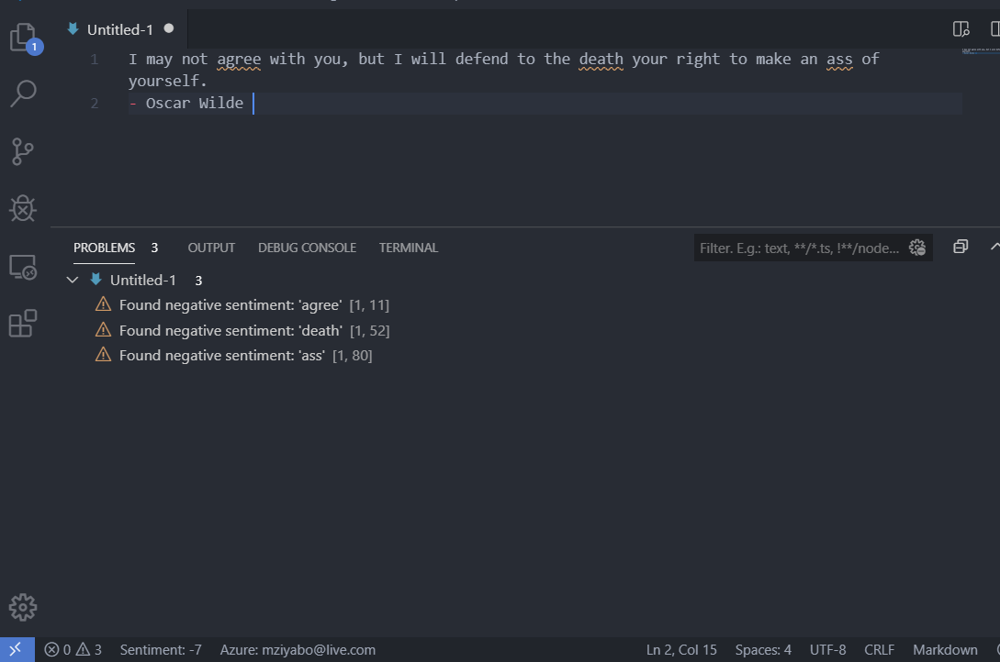

# vscode sentiment extension
  
 
Visual Studio Code extension project to perform sentiment analysis on text. Uses the [npm sentiment library](https://www.npmjs.com/package/sentiment) to analyze sentiment based on the [AFINN](http://www2.imm.dtu.dk/pubdb/views/edoc_download.php/6006/pdf/imm6006.pdf) word list.

## Features:

- Negative words in the AFINN list are underlined with a warning squiggly and also noted in the `Problems` tab. 
- Overall sentiment of the document (plaintext/markdown) is displayed in the status bar:

## Command Palette
- `Sentiment: perform sentiment analysis` : to analyze manually.

## Licence:
This extension is released under the [Apache 2.0 License](https://www.apache.org/licenses/LICENSE-2.0)